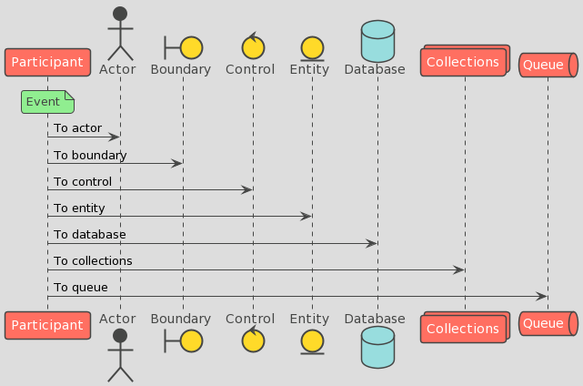
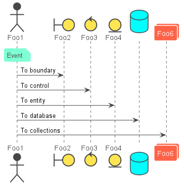

# puml-themes

PlantUML theme for all developers. 

## Abstract

This theme is suitable for use in expressing the processing flow of business functions mass-produced by a team. It is mainly intended for use in sequence diagrams.

For more detailed explanation, please check [here(日本語)](https://future-architect.github.io/articles/20200203/).

## Usage

Write `!include <This repository plantuml path>` between @startuml and @enduml block.

### Example toy theme

Use the theme from your diagram:

```
@startuml 
!include https://raw.githubusercontent.com/future-architect/puml-themes/master/themes/puml-theme-toy.puml

actor Foo1
boundary Foo2
control Foo3
entity Foo4
database Foo5
collections Foo6
note over Foo1: Event
Foo1 -> Foo2 : To boundary
Foo1 -> Foo3 : To control
Foo1 -> Foo4 : To entity
Foo1 -> Foo5 : To database
Foo1 -> Foo6 : To collections

@enduml
```

Output is bellow.




### Example vibrant theme

```
@startuml 
!include https://raw.githubusercontent.com/future-architect/puml-themes/master/themes/puml-theme-vibrant.puml

actor Foo1
boundary Foo2
control Foo3
entity Foo4
database Foo5
collections Foo6
note over Foo1: Event
Foo1 -> Foo2 : To boundary
Foo1 -> Foo3 : To control
Foo1 -> Foo4 : To entity
Foo1 -> Foo5 : To database
Foo1 -> Foo6 : To collections

@enduml
```

Output is bellow.




## License
This version of giglocal is released under the Apache License, Version 2.0 (see [LICENSE](https://github.com/future-architect/puml-themes/blob/master/LICENSE)).
