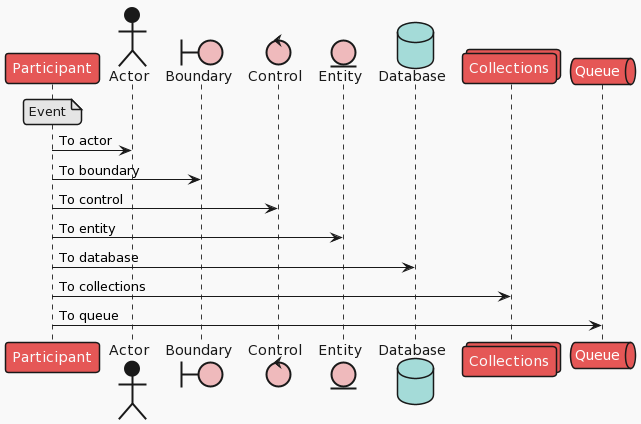

# puml-themes

PlantUML themes for all developers. 

## Abstract

These themes were created as part of a standardization effort to help design teams mass-produce business functions' processing flows. It is mainly intended for use in sequence diagrams.

For more details, please check [here(日本語)](https://future-architect.github.io/articles/20200203/). (available in Japanese only)

## Usage

Write `!include <path to the wanted theme in this repository>` between @startuml and @enduml block.

### Example of 'toy' theme

```
@startuml 
!include https://raw.githubusercontent.com/future-architect/puml-themes/master/themes/puml-theme-toy.puml

participant Participant as Foo
note over Foo: Event
actor       Actor       as Foo1
boundary    Boundary    as Foo2
control     Control     as Foo3
entity      Entity      as Foo4
database    Database    as Foo5
collections Collections as Foo6
queue       Queue       as Foo7
Foo -> Foo1 : To actor 
Foo -> Foo2 : To boundary
Foo -> Foo3 : To control
Foo -> Foo4 : To entity
Foo -> Foo5 : To database
Foo -> Foo6 : To collections
Foo -> Foo7: To queue

@enduml
```

Output is bellow.


### Example of 'vibrant' theme

```
@startuml 
!include https://raw.githubusercontent.com/future-architect/puml-themes/master/themes/puml-theme-vibrant.puml

participant Participant as Foo
note over Foo: Event
actor       Actor       as Foo1
boundary    Boundary    as Foo2
control     Control     as Foo3
entity      Entity      as Foo4
database    Database    as Foo5
collections Collections as Foo6
queue       Queue       as Foo7
Foo -> Foo1 : To actor 
Foo -> Foo2 : To boundary
Foo -> Foo3 : To control
Foo -> Foo4 : To entity
Foo -> Foo5 : To database
Foo -> Foo6 : To collections
Foo -> Foo7: To queue

@enduml
```

Output is bellow.


### Example of 'mars' theme

```
@startuml 
!include https://raw.githubusercontent.com/future-architect/puml-themes/master/themes/puml-theme-mars.puml

participant Participant as Foo
note over Foo: Event
actor       Actor       as Foo1
boundary    Boundary    as Foo2
control     Control     as Foo3
entity      Entity      as Foo4
database    Database    as Foo5
collections Collections as Foo6
queue       Queue       as Foo7
Foo -> Foo1 : To actor 
Foo -> Foo2 : To boundary
Foo -> Foo3 : To control
Foo -> Foo4 : To entity
Foo -> Foo5 : To database
Foo -> Foo6 : To collections
Foo -> Foo7: To queue

@enduml
```

Output is bellow.



All the theme above are also available in the official PlantUML theme library.
However, all future updates and themes will be reflected in this repository first.

## License
This version of puml-themes is released under the Apache License, Version 2.0 (see [LICENSE](https://github.com/future-architect/puml-themes/blob/master/LICENSE)).
